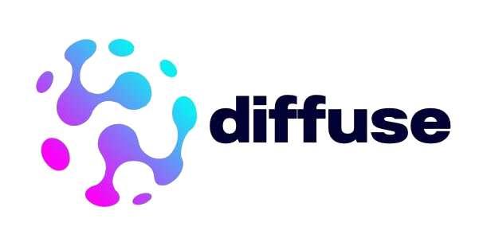

# diffuse-chat

**A chat interface for a Diffuse Enterprise deployment.** People in your
organisation sign in, pick a model your deployment serves, and chat. Nothing
leaves your infrastructure: the interface runs on your machines and talks to
your coordinator.

Built on [LibreChat](https://www.librechat.ai), deployed **upstream and
unmodified, pinned by digest**. This repository does not fork LibreChat and does
not patch it. Everything it does goes through LibreChat's own configuration or
its own HTTP API, so an upstream security fix is a digest change here rather
than a merge.

**Documentation:**
[Chat interface](https://docs.diffuse-systems.com/enterprise/chat) on the
Diffuse Enterprise documentation site. That page is the one to send to somebody
who has not deployed this before; this file is the repository's own reference.

**Contributions are not accepted.** This is a commercial product's deployment
tooling, published so customers can read what runs on their own machines. Issues
and pull requests are not monitored; support goes through your contract.

---

## Who this is for

Two profiles, one command apart. The difference is what the audit trail on your
deployment can tell you afterwards.

|  | developer | enterprise |
|---|---|---|
| who it is for | one person, one laptop | an organisation |
| credential | one ordinary API key | one **gateway** credential, `--act-as` |
| who the deployment sees | the key | **the person who signed in** |
| an audit row reads | `apikey/V7S80Q12` | `identity/6a8f44f9 via apikey/QQ5WDKKE` |
| model catalogue | what the key may call | what **that person** may call |
| rate limits | shared by everyone | per person |
| registration | open until the first account | closed |
| who may use it | anyone with an account here | people an operator imported |

Take the enterprise profile the moment "who generated this" is a question
somebody could be asked. Only that profile puts a person's name on the row.

## What you need first

A **Diffuse Enterprise deployment that already works**: a coordinator
installed, and at least one model served, so that `GET /v1/models` answers.
Installing that is a different job and is documented at
[Deployment](https://docs.diffuse-systems.com/enterprise/deployment).

Two different programs are involved, and it matters which machine each runs on:

| command | what it is | where it runs |
|---|---|---|
| `diffuse-coordinator` | the coordinator binary, already installed from `diffuse-coordinator_amd64.deb` | on the **coordinator host** |
| `./diffuse-chat` | a shell script **in this repository**, at its root | on the **machine that runs the chat interface** |

They may be the same machine. Nothing here requires otherwise.

The chat host needs **Docker with the compose plugin**, and network access to
your coordinator's `/v1` port.

## Install

### 1. Get this repository

`./diffuse-chat` is not installed by any package and there is no copy of it on
the coordinator. It is the script at the root of this repository:

```bash
git clone https://github.com/diffuse-systems/diffuse-chat.git
cd diffuse-chat
```

Every `./diffuse-chat` command below runs from inside that directory.

### 2. Configure

```bash
cp .env.example .env
```

Fill in three values:

| value | where it comes from |
|---|---|
| the `/v1` endpoint | your coordinator's host and API port, e.g. `https://coordinator.internal:8443/v1` |
| the path to `ca.crt` | copy `/etc/diffuse/ca.crt` from the coordinator to this machine |
| a credential | created on the coordinator, in step 3 |

`./diffuse-chat up` writes the rest of `.env` itself, LibreChat's four secrets
and the service account it uses to own the shared agent, into the same file,
mode 0600. **`.env` is not committed and must not be.**

### 3a. The developer profile

One ordinary API key, created **on the coordinator**, not here:

```bash
# on the coordinator host
diffuse-coordinator apikey create --name chat
```

Put the key it prints into `.env`, then, **in this repository**:

```bash
./diffuse-chat up
./diffuse-chat doctor
```

Open `http://127.0.0.1:3080`, create your account, and chat. Registration closes
by itself: the next `up` sees a person and shuts the door behind you.

### 3b. The enterprise profile

Two commands **on the coordinator**. The first issues the gateway credential,
the only kind allowed to say which person a request is for; the second tells the
deployment who those people are:

```bash
# on the coordinator host
diffuse-coordinator apikey create --name chat --act-as
diffuse-coordinator identity import users.csv
```

Then, **in this repository**:

```bash
./diffuse-chat up --enterprise
./diffuse-chat doctor
```

Registration is closed in this profile. Accounts are not created here; they are
imported on the coordinator, and somebody signing in who is not in `users.csv`
is refused by the endpoint with a message saying so.

The gateway credential is a master key for your organisation's traffic. Read
[`THREAT_MODEL.md`](THREAT_MODEL.md) before you deploy it: one page, and the
first section is the one that matters.

## Run

All three run **in this repository**:

```bash
./diffuse-chat doctor          # what is actually working, and if not, why
./diffuse-chat down            # stop it
./diffuse-chat down --volumes  # and forget the conversations and accounts
```

`doctor` checks the things that break in practice: the images running are the
digests this repository pins, LibreChat answers, the deployment's CA is mounted
where node will look for it, the TLS chain validates **from inside the
container**, the endpoint answers this credential the way this profile expects,
and the default agent exists *and is shared*.

## Branding

`APP_TITLE` and `CUSTOM_FOOTER` in `.env`; images in `branding/assets`, mounted
over LibreChat's own. See [`branding/README.md`](branding/README.md). A
customer's logo never means a rebuilt image and never means a fork.

`titleConvo` is **off** by default, and turning it on has two costs rather than
being a preference. Both are set out under
[Conversation titles are off, and why](https://docs.diffuse-systems.com/enterprise/chat#conversation-titles-are-off-and-why).

## Two things to read before deploying this

Both live elsewhere because they are longer than a README should carry, and
because an operator needs them before touching this repository rather than
while reading it:

- **The threat model**, [`THREAT_MODEL.md`](THREAT_MODEL.md): what putting a
  chat interface in front of the deployment adds. The gateway credential as a
  master key, what bounds it, what is not mitigated and why.
- **The limitation to know before a user reports it**: a refusal from the
  deployment is not shown to the person as a refusal, and the error they see
  blames the model rather than the cause. What an operator does about it is one
  command on the coordinator, and it is written up under
  [The limitation to know before a user reports it](https://docs.diffuse-systems.com/enterprise/chat#the-limitation-to-know-before-a-user-reports-it).
  The measurement behind it is in
  [`evidence/refusal-in-the-ui.md`](evidence/refusal-in-the-ui.md).

---

## v0.8.7, what the upstream documentation does not say

The rest of this file is for whoever maintains this repository or scripts
against the same stack. Five facts, each of which cost real time to find, all
measured against `ghcr.io/danny-avila/librechat@sha256:c5db3331…`, the digest
this repository pins, not against a tag and not against the development branch.

### 1. There is no direct chat. Every conversation needs an agent

There is no `/api/ask` route. Everything goes through `/api/agents/chat` and
requires an `agent_id`; a custom endpoint is reached through an agent that names
it as a *provider*. Out of the box the composer says "Please select an Agent"
and nothing can be sent.

**So `./diffuse-chat up` provisions one**, called `Diffuse`, and shares it with
everybody who can sign in. A shipped profile that told each user to build their
own agent first would not be a product.

It is created through `POST /api/agents` and shared through
`PUT /api/permissions/agent/<_id>`, which is what the UI does. Seeding the
`agents` collection in Mongo directly, the obvious shortcut, and what the smoke
test tried first, half-works: the document appears, and then a plain user is
refused **their own** agent with "Insufficient permissions to access this
agent", because v0.8.7 gates agents on ACL rows in a separate collection that a
hand-written document does not create. Going through the API makes LibreChat
write its own ACL rows, which is also a schema this repository then never has to
track.

Two smaller traps in the same corner: the permissions API is keyed on the Mongo
`_id`, not on the `id` string the rest of the agent API uses (passing the wrong
one answers `400 Invalid resource ID`), and the agent schema requires a `model`
even though the person picks one afterwards.

### 2. `endpointsMenu` and `modelSelect` are off, and turning them on is not enough

v0.8.7 hides the endpoint picker and the model selector by default. Both configs
here re-enable them, so a person can see which deployment they are talking to,
but that is a convenience, **not** what makes the chat work. Re-enabling them
was tried during the smoke test and the composer still demanded an agent. If you
remove the provisioning step above expecting these two settings to cover it, you
get a stack nobody can send a message from.

### 3. `uaParser` refuses anything that is not a browser

`api/server/middleware/uaParser.js` answers `{"message":"Illegal request"}` to
any request whose user agent is not a browser. It applies to the whole API and
looks nothing like a permission problem: it cost the smoke test more than every
other obstacle combined, because agent creation and every chat attempt failed
identically for a reason that was neither.

**So every call `./diffuse-chat` makes to LibreChat presents a browser user
agent**, with a comment in the source saying why. If you script against this
stack yourself, do the same.

### 4. A refusal from the deployment is not shown to the person

Summarised above and written up in full on the documentation site. The mechanism
is that the 403 refuses LibreChat's per-request catalogue fetch before the
completion call ever happens, so LibreChat concludes the model is unavailable:

```
event: error
data: {"error":"{ \"type\": \"illegal_model_request\", \"info\": \"Diffuse|diffuse-demo\" }"}
```

There is one configuration that changes it, and it is a trade rather than a fix:
with `models.fetch: false` and the model named literally in `default`, LibreChat
calls the endpoint anyway and logs the deployment's real sentence verbatim, but
the person then sees an *empty* reply instead of an error and the catalogue
stops being filtered per person. Shipped as `fetch: true` for that reason, with
the measurement in [`evidence/refusal-in-the-ui.md`](evidence/refusal-in-the-ui.md).

### 5. `${VARIABLES}` are not substituted inside `models`

They are substituted in `apiKey` and `baseURL` and arrive **literally** inside
`models.default`, where they would show up in the picker as their own name. And
`models.default` may not be empty, even with `fetch: true`: the config schema
requires at least one element. So both config files carry a literal placeholder
there, which is only ever displayed when the deployment cannot be reached.

---

## What else is in here

- [`THREAT_MODEL.md`](THREAT_MODEL.md): the façade side of design 021 §6.
- [`evidence/smoke-verdict.md`](evidence/smoke-verdict.md): what LibreChat
  actually sends, captured whole, from two different accounts.
- [`evidence/delegation-demo.md`](evidence/delegation-demo.md): the same stack
  in front of a real deployment built from the release packages: two people, two
  audit rows, one credential.
- [`evidence/refusal-in-the-ui.md`](evidence/refusal-in-the-ui.md): what a
  refused person actually sees, read off the stream, and the one configuration
  that changes it.
- [`tests/acceptance.sh`](tests/acceptance.sh): the promise above, measured from
  a clean machine.
- `compose.smoke.yaml`, `receiver/`: the capture stub those two were measured
  with. Kept because a version bump re-runs that measurement rather than
  assuming it still holds.
